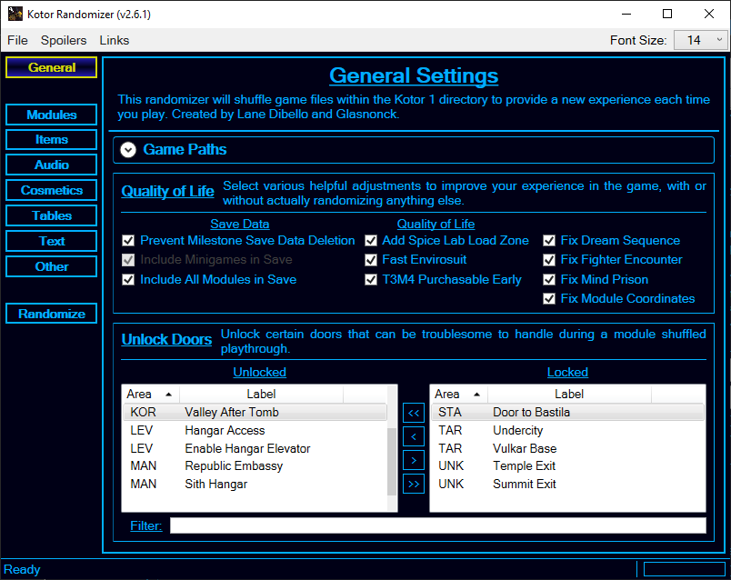
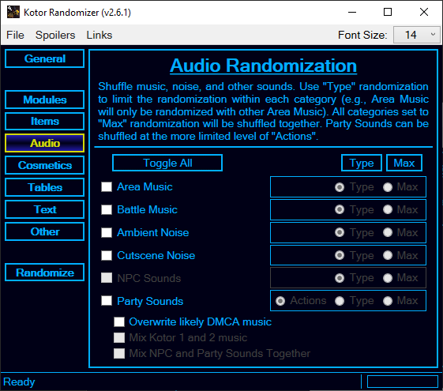

<h1>  Kotor Randomizer</h1>

A randomizer for Star Wars: Knights of the Old Republic designed for speedrunners and other gamers seeking a challenge.

## Download
You can download the Windows installer for latest release either from the [resources page](https://www.speedrun.com/kotor1/resources) (look for "Kotor Randomizer") on the KotOR speedrunning community's speedrun.com leaderboard or directly from the [release page](https://github.com/LaneDibello/Kotor-Randomizer/releases/latest) here on GitHub.

## Features
* [General Usability Improvements](#general)
* [Module Randomization](#modules)
* [Item Randomization](#items)
* [Audio Randomization](#audio)
* [Cosmetic Randomization](#cosmetics)
* [Table Randomization](#tables)
* [Text Randomization](#text)
* [Other Randomization](#other)
* [Randomization Presets](#presets)

<table>
  <tr><td colspan="2" align="center"><b id="general">General Usability Improvements</b></td></tr>
  <tr>
    <td align="center"></td>
    <td>
      <ul>
        <li>Enable various quality of life improvements to make it easier to play through any given randomization.</li>
        <li>Improvements include fixes and patches that prevent softlocks, game crashes, and unreachable locations.</li>
        <li>Unlock doors throughout the game that would prevent the player from advancing in case the usual unlocking method is no longer accessable.</li>
      </ul>
    </td>
  </tr>
  <tr><td colspan="2" align="center"><b id="modules">Module Randomization</b></td></tr>
  <tr>
    <td align="center"></td>
    <td>
      <ul>
        <li>Shuffles the modules (levels) together such that most loading zones will take you somewhere other than the usual destination.</li>
        <li>Rule-Based Exclusions. Ensures certain module replacement rules are not violated, giving a nicer randomization without trapped zones.</li>
        <li>Reachability Verification. Sets the parameters for some simple digraph math, that will help assure the shuffle is beatable based on a variety of selected goals.</li>
      </ul>
    </td>
  </tr>
  <tr><td colspan="2" align="center"><b id="items">Item Randomization</b></td></tr>
  <tr>
    <td align="center"></td>
    <td>
      <ul>
        <li>Toggle which item categories will be randomized. All items included in these categories will be shuffled around and will replace one another.</li>
        <li>Choose your level of randomization. Allows the user to select if these item categories (and their sub-categories) will be mixed together or not.</li>
        <li>Omitted items allow the user to select which items to not randomize at all. Omit presets are available to simplify this choice.</li>
      </ul>
    </td>
  </tr>
  <tr><td colspan="2" align="center"><b id="audio">Audio Randomization</b></td></tr>
  <tr>
    <td align="center"></td>
    <td>
      <ul>
        <li>Toggle which music and sound categories will be randomized. The sound files for these categories will be shuffled around and will replace one another.</li>
        <li>Choose your level of randomization. Allows the user to select if these categories (and their sub-categories) will be mixed together or not.</li>
        <li>Optionally remove music that might trigger DMCA algorithms flagging content uploaded online.</li>
      </ul>
    </td>
  </tr>
  <tr><td colspan="2" align="center"><b id="cosmetics">Cosmetic Randomization</b></td></tr>
  <tr>
    <td align="center"></td>
    <td>
      <ul>
        <li>Randomize a variety of in-game cosmetics with the intent of minor impact on gameplay.</li>
        <li><i>Animations</i>
          <ul>
            <li>Randomize animations used throughout the game by category: attacking, getting hit, moving, etc.</li>
            <li>Choose your level of randomization. Allows the user to select if these categories will be mixed together.</li>
          </ul>
        </li>
        <li><i>Models</i>
          <ul>
            <li>Randomize the appearance of creatures and characters appearing throughout the game.</li>
            <li>Randomize the models of placeables (inanimate objects).</li>
            <li>Randomize the different doors types appearing in the game.</li>
          </ul>
        </li>
        <li><i>Textures (*WARNING: May be triggering for photosensitive viewers*)</i>
          <ul>
            <li>Toggle which texture categories will be randomized. All textures included in these categories will be shuffled around and will replace one another.</li>
            <li>Choose your level of randomization. Allows the user to select if these categories will be mixed together.</li>
            <li>Select which quality texture pack will be shuffled.</li>
          </ul>
        </li>
      </ul>
    </td>
  </tr>
  <tr><td colspan="2" align="center"><b id="tables">Table Randomization</b></td></tr>
  <tr>
    <td align="center"></td>
    <td>
      <ul>
        <li>Scramble many of the different reference tables used by the game.</li>
        <li>There are many widely varied options, including experience gain, class skills, feat and power descriptions, and character heads.</li>
      </ul>
    </td>
  </tr>
  <tr><td colspan="2" align="center"><b id="text">Text Randomization</b></td></tr>
  <tr>
    <td align="center"></td>
    <td>
      <ul>
        <li>Randomize the dialogue given by different NPCs.</li>
        <li>Randomize the reply options the PC can give.</li>
        <li>Randomize all other text in the game.</li>
      </ul>
    </td>
  </tr>
  <tr><td colspan="2" align="center"><b id="other">Other Randomization</b></td></tr>
  <tr>
    <td align="center"></td>
    <td>
      <ul>
        <li>Tamper with the Player Name Generator used in character creation.</li>
        <li>Cause torso equipment to randomly polymorph the character equipping it.</li>
        <li>Randomize the cards found in NPC pazaak decks.</li>
        <li>Randomize which NPCs and Creatures are your party members.</li>
        <li>Alter swoop races by randomizing the placement of booster pads and/or obstacles.</li>
      </ul>
    </td>
  </tr>
  <tr><td colspan="2" align="center"><b id="presets">Randomization Presets</b></td></tr>
  <tr>
    <td align="center"></td>
    <td>
      <ul>
        <li>Save your wild randomizer settings to a file that can be opened up later.</li>
        <li>Share your preset file and seed with your friends so you can both experience the same randomization.</li>
        <li>Per category seeding means that two players can have different active categories but still have similar experiences when using the same seed.</li>
      </ul>
    </td>
  </tr>
</table>

## Credit
The Kotor Randomizer was created by Lane and Glasnonck, with help from the kotor speedrunning community. If you'd like to get in contact with either of us, try messaging us in the #variety-runs channel on the Kotor Speedrunning discord server.

* [Lane’s Twitch](https://www.twitch.tv/lane_m)
* [Glasnonck’s Twitch](https://www.twitch.tv/glasnonck)
* [Kotor Speedrunning Community Discord](http://discord.gg/Q2uPRVu)
* [Kotor Speedruns SRC page](https://www.speedrun.com/kotor1)
